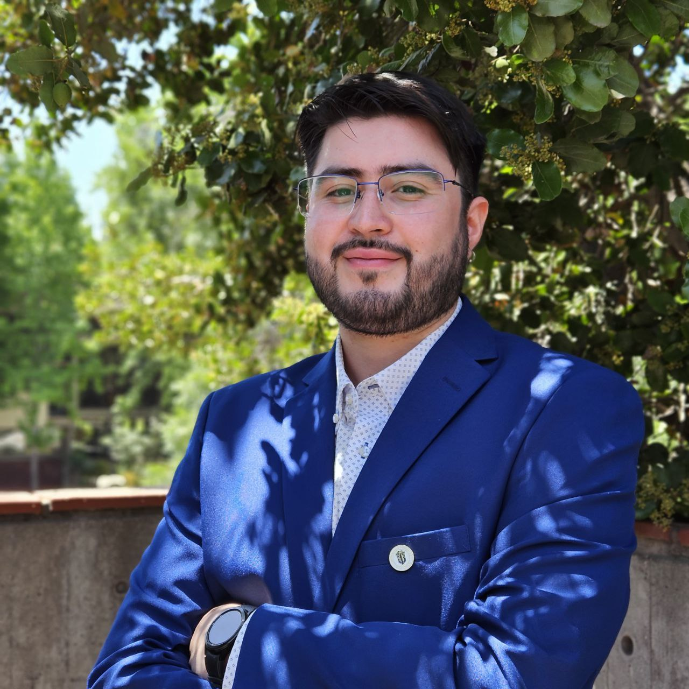
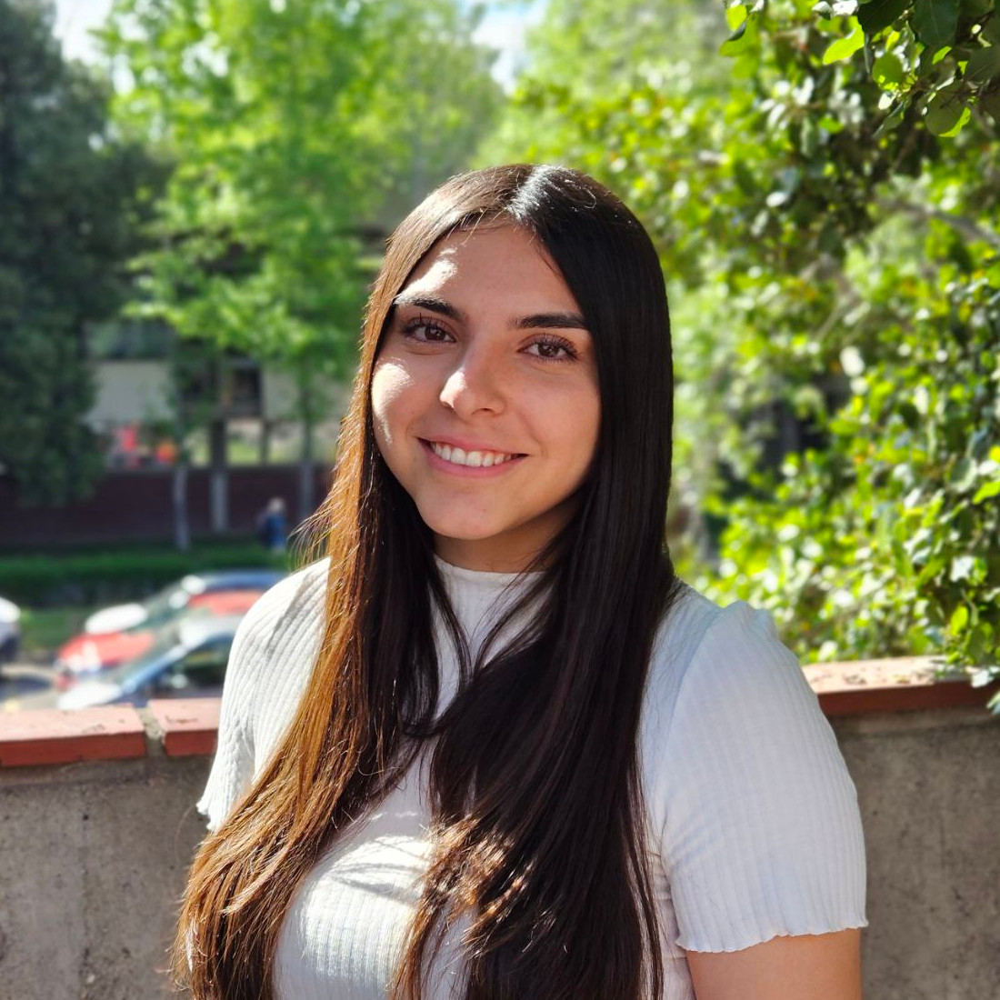
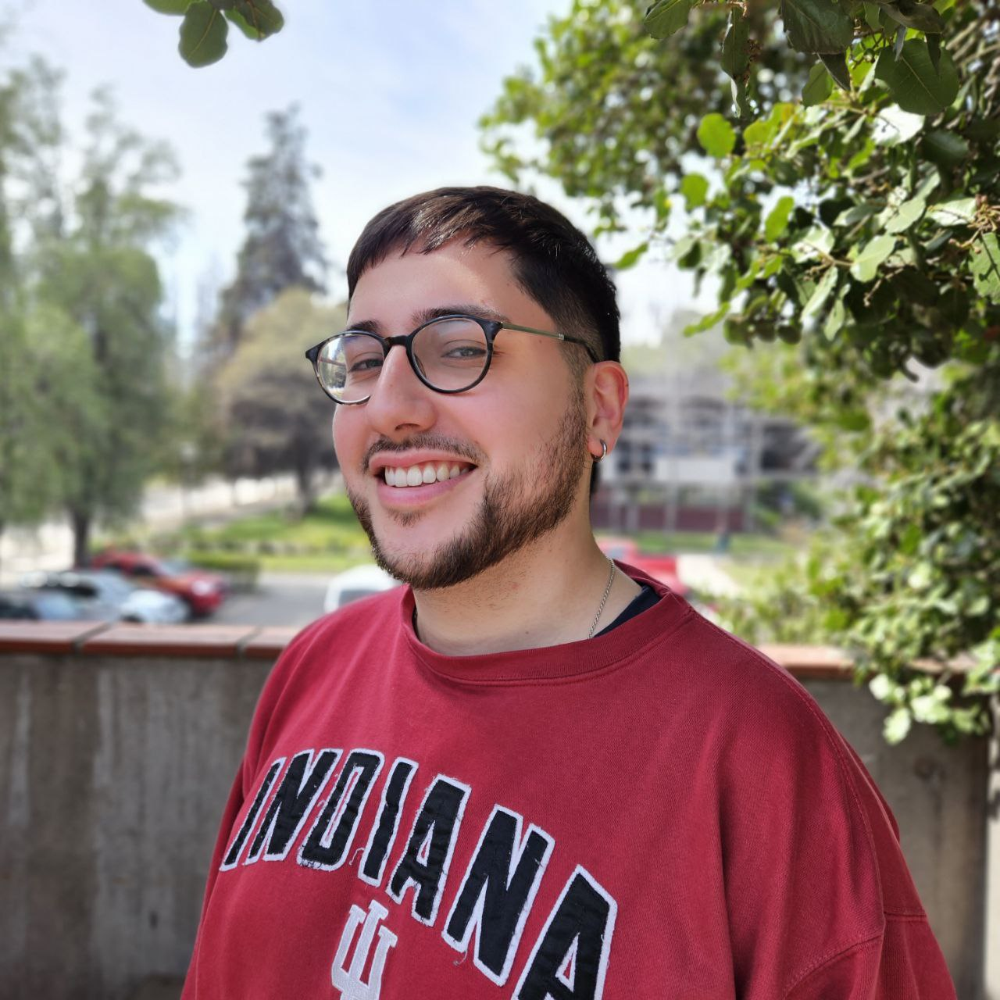

<!-- **Statement acá:** Vestibulum convallis, lorem a tempus semper, dui dui euismod elit, vitae placerat urna tortor vitae lacus. -->

# Académicos

**Christian Salas-Eljatib**

Profesor titular. Departamento de Gestión Forestal y su Medio Ambiente.

Director del Laboratorio de Biometría y Modelación Forestal.

[eljatib.com](https://eljatib.com)

<!-- Director del Laboratorio de Biometría y Modelación Forestal. -->

**Patricio Corvalán**

Profesor asociado. Departamento de Gestión Forestal y su Medio Ambiente.

<!-- Director del Laboratorio de Biometría y Modelación Forestal. -->

# Encargados

**Nicolás Campos**

Asistente de Investigación. Ingeniero Forestal.

Coordinador técnico del Laboratorio de Biometría y Modelación Forestal.

**Natalia Pizarro**

Asistente de Investigación. Licenciada en Ciencias Forestales.

Coordinadora de proyectos del Laboratorio de Biometría y Modelación Forestal.

# Estudiantes

**Rocío Reinoso**

Licenciada en Ciencias Forestales, Memorante.

<i>"Comparación interespecífica de la alometría altura diámetro en especies nativas."</i>

**Víctor Pacheco**

Memorante.

<i>"Variación en la forma fustal entre dos poblaciones de _Nothofagus pumilio_ en la Región de Magallanes."</i>

**Marcos Marivil**

Memorante.

<i>"Predicción del diámetro normal en función de características del tocón de 14 especies nativas de Chile."</i>

**Nicolás Clavero**

Memorante.

<i>"Modelos de razón de copa en bosques de Nothofagus Pumilio."</i>

